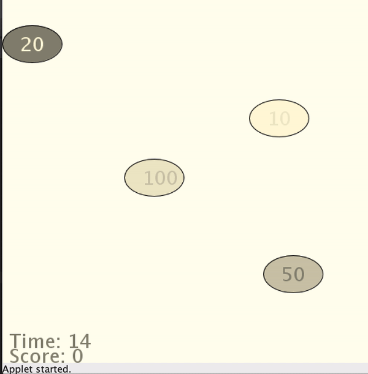

# Catching Disk Game (Java/Processing)

### An interactive game in which user wins points by clicking on moving disks

* Each disk move at its own direction and rate
*	Each disk has its own value associated with it, depending on how hard it is to catch it
*	program detects if the user successfully clicked on a disk or not
*	if the user successfully clicks on the disk, the disk’s point value is added to the user’s total and the disk disappears
*	The game lasts 1 minute. After one minute the total value of points collected are displayed

### Demo

